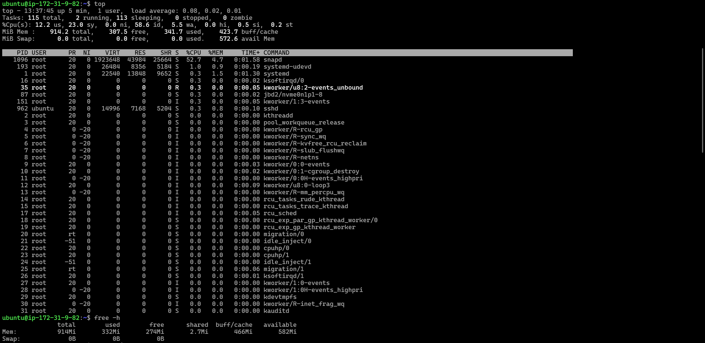
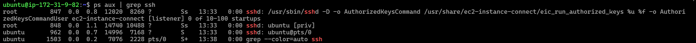
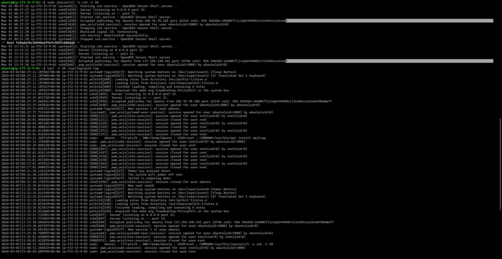

# Day 05 – Linux Troubleshooting Runbook (SSH Service)

## 🎯 Target Service
ssh (OpenSSH Daemon)

---

## 🖥️ Environment Check

Verified kernel version, architecture, and Ubuntu OS details.

---

## 🧠 Memory Check

Checked system memory usage using `free -h` and `top`.

---

## 💾 Disk Usage Check

Verified available disk space using `df -h`.

---

## 🔎 Process Check

Checked running SSH process using `ps aux | grep ssh`.

---

## 🌐 Port Listening Check

Verified SSH is listening on port 22 using `ss -tulpn`.

---

## 📜 SSH Service Logs

Checked logs using:

`sudo journalctl -u ssh -n 50`

---

## 🌍 Connectivity / Web Check

Verified connectivity and service behavior.

---

## ⚠️ Connection Observation

Observed session disconnect behavior.

---

## 📚 Key Learnings

- Always check logs before restarting services  
- Validate system health before assuming failure  
- Structured troubleshooting saves time  
- Never blindly restart SSH on production  

---

#90DaysOfDevOps  
#DevOpsKaJosh  
#TrainWithShubham
